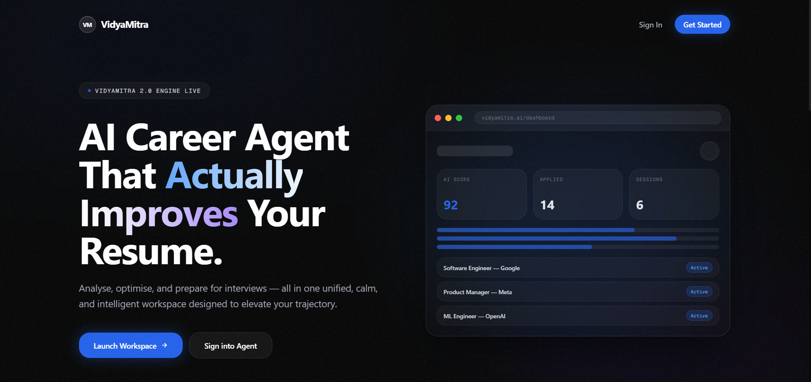

# Harsh Kumar Yadav — High-Performance Full Stack + AI Portfolio

A premium, production-grade developer portfolio built with a focus on high-end aesthetics, "Apple-smooth" scrolling, and interactive 3D elements. Designed for a SaaS-level experience with architectural typography and sophisticated animations.



## ✨ Key Features

- 🍏 **Apple-Smooth Scrolling**: Integrated with **Lenis** for inertial, high-performance scrolling across all browsers.
- 🍱 **Bento-Grid Projects**: A modular, editorial-style projects section featuring featured hero cards and interactive hover states.
- 🕸️ **3D Wireframe Scene**: Interactive background using **Three.js** that responds to mouse movement, creating an immersive neural-architectural vibe.
- 📱 **Fully Responsive 2.0**: Re-architected for desktop, tablet, and mobile with a custom-built glassmorphism mobile menu and stacked layouts for narrow viewports.
- 📨 **EmailJS Integration**: Fully functional contact section that delivers messages directly to your inbox without a backend.
- 📄 **Direct Resume Access**: One-click resume download integrated into both the About and Contact sections.
- ⚡ **Performance Optimized**: Optimized GPU rendering by locking pixel ratios for consistent 60FPS and using efficient CSS transforms.

## 🛠️ Tech Stack

| Layer | Technology |
|---|---|
| **Framework** | React 18 + Vite |
| **Styling** | Vanilla CSS + Framer Motion |
| **3D Engine** | Three.js |
| **Animations** | Framer Motion |
| **Smooth Scroll** | Lenis (Inertial Scrolling) |
| **Communication** | EmailJS |
| **Typography** | Plus Jakarta Sans · Inter |

## 📂 Project Structure (Cleaned & Optimized)

```text
src/
├── components/
│   ├── Projects.jsx      ← Premium Bento-Grid layout with responsive metrics
│   ├── Navbar.jsx        ← Dynamic bar with mobile overlay menu
│   ├── Experience.jsx    ← Mobile-first alternating timeline
│   ├── Hero.jsx          ← High-impact landing with 3D WireframeScene
│   ├── TerminalBoot.jsx  ← Immersive system-boot loading sequence
│   └── BackgroundLayer.jsx ← Global blueprint grid & ambient glows
├── sections/
│   ├── About.jsx         ← Storytelling + Portrait Blob + Resume CTA
│   └── Contact.jsx       ← EmailJS-powered form + Mobile-stacked actions
├── data/
│   └── portfolioData.js  ← Central source of truth for all content
└── App.jsx               ← Global orchestration & Scroll Management
```

## 🚀 Quick Start

1. **Clone & Install**
   ```bash
   git clone https://github.com/Harsh-Yadav029/Personal-Portfolio.git
   cd Personal-Portfolio
   npm install
   ```

2. **Environment Variables**
   Create a `.env` file in the root and add your EmailJS credentials:
   ```env
   VITE_EMAILJS_SERVICE_ID=your_service_id
   VITE_EMAILJS_TEMPLATE_ID=your_template_id
   VITE_EMAILJS_PUBLIC_KEY=your_public_key
   ```

3. **Run Development**
   ```bash
   npm run dev
   ```

4. **Build for Production**
   ```bash
   npm run build
   ```

## 🎨 Customization

The entire portfolio is **data-driven**. To update your personal information, projects, or experience, simply edit:
👉 `src/data/portfolioData.js`

No need to touch the complex animation or 3D logic unless you want to customize the engine itself.

## 📈 Performance Notes

- **Scroll Performance**: Ensure `Lenis` is initialized in `App.jsx` for the signature smoothness.
- **3D Optimization**: The background scene is set to `lowp` precision and `pixelRatio: 1` to ensure accessibility on lower-end devices.
- **Mobile First**: All sections (especially Projects and Experience) use CSS media queries to switch from complex grids to simplified stacks on mobile.

---

Built with ❤️ by [Harsh Kumar Yadav](https://github.com/Harsh-Yadav029)
